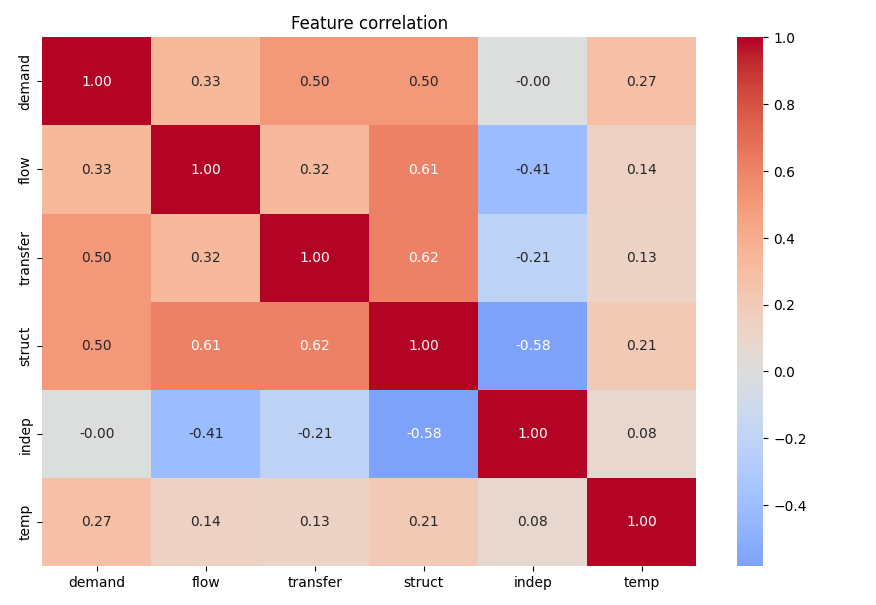
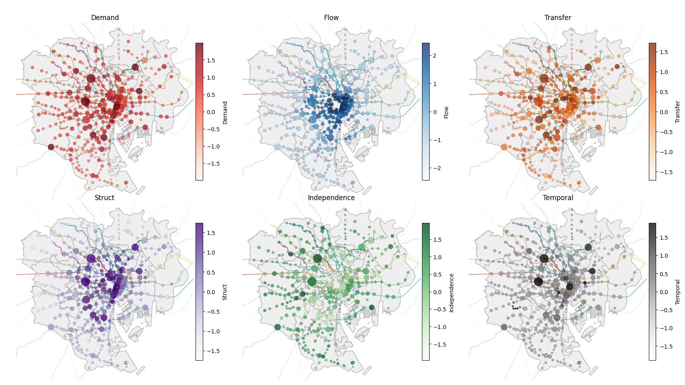
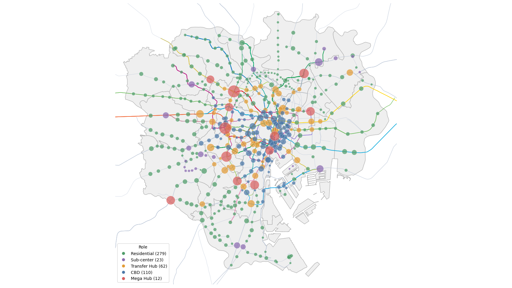
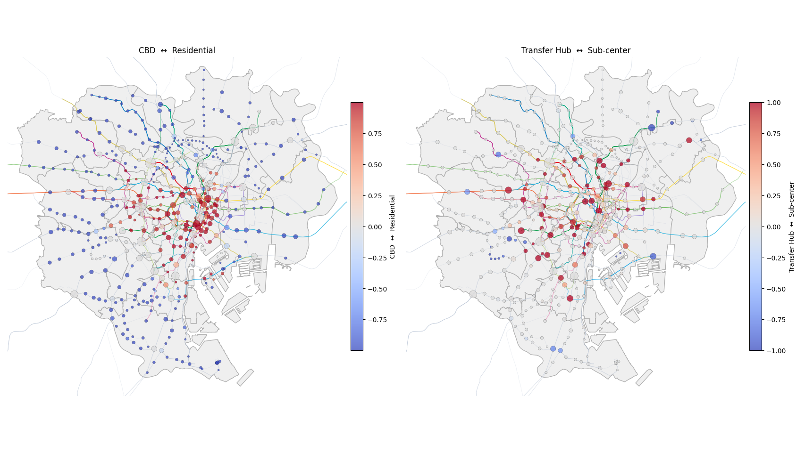
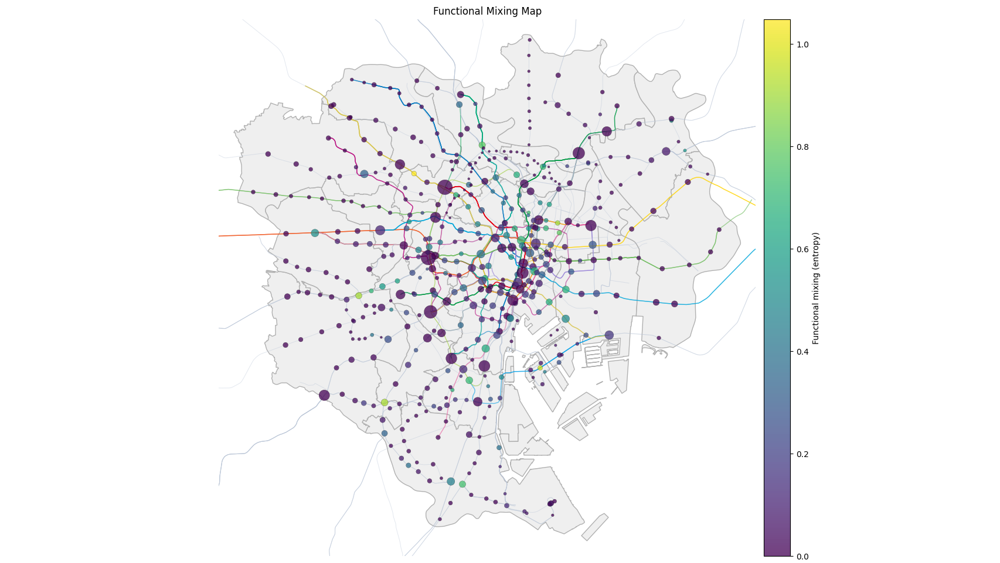
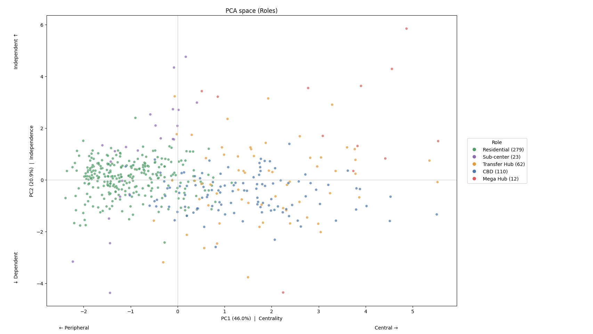

# Tokyo Railway Network Analysis

## Overview
This project analyzes the railway network in Tokyo's 23 wards to identify the structural roles of stations beyond simple ridership.

Instead of evaluating stations solely by passenger volume, this study incorporates network structure, spatial context, and diffusion-based signals to uncover hidden functional roles.

---

## Why it Matters

This approach enables:

- Identifying structurally important stations overlooked by ridership
- Understanding urban functional zones beyond administrative boundaries
- Supporting data-driven urban planning and transportation policy

---

## Background

In large metropolitan systems like Tokyo, ridership is often used as the primary indicator of station importance.

However, ridership alone cannot fully capture:
- structural position in the network
- interaction between neighboring stations
- functional differentiation of urban space

This project introduces a structure-aware signal framework to address these limitations.

---

## Key Idea

### Diffused Signal

A signal is constructed by combining:

- **Ridership (S12 data)**
- **Urban flow indicators**
  - day/night population ratio
  - inter-prefecture inflow rate
  - inter-municipality outflow rate
- **Network structure**
  - degree
  - centrality measures
  - number of lines

These components are normalized and combined into a base signal.

---

### Signal Diffusion

The signal is propagated through the network so that each station reflects not only its own characteristics, but also the influence of nearby stations.

In other words, a station located near a major hub will partially inherit its structural importance.

This process is modeled as:

```text
x_{t+1} = αx_0 + (1−α)P x_t
```

where:
- P is the transition matrix derived from graph connectivity
- α controls how much of the original signal is preserved

Through this iterative process, the signal spreads across the network,
capturing both local and global structural effects.

---

## Methodology

### 1. Station Integration
- Station name normalization
- DBSCAN clustering (eps=50m) to merge nearby stations

Final network:
- 486 nodes
- 670 edges

---

### 2. Network Feature Construction

To represent structural properties of stations, the following graph-based features were constructed:

- **n_lines**: number of railway lines connected to each station
- **is_transfer**: binary indicator of transfer stations (2 or more lines)
- **betweenness centrality**: extent to which a station lies on shortest paths
- **closeness centrality**: proximity to other stations in the network
- **k-core**: embeddedness in the network core
- **articulation flag**: whether removing the station disconnects the graph
- **reach2**: number of stations reachable within two hops
- **neighbor ridership statistics**: mean / median / max ridership of adjacent stations
- **rid_nb_ratio**: ratio between a station's own ridership and neighboring ridership
- **hub exposure**: influence received from major hub stations over the network

These features provide the structural basis for later signal construction and role interpretation.

---

### 3. Signal Construction

Initially:
- A single signal was used

Limitation:
- Role separation was unclear
- Large hubs dominated surrounding stations (**hub dominance effect**)

Solution:
- Signal decomposed into 7 axes
- Residual excluded → final 6D feature space

This decomposition was introduced to separate different aspects of station function that were previously mixed into a single value.

---

### 4. Feature Decomposition

Final model uses a 6-dimensional space (excluding residual)

Reason:
- Residual showed high correlation with demand
- Captured scale effects rather than structure
- Introduced redundancy and distortion

This step improved interpretability by reducing duplication between size-related and structure-related information.

---

### 5. Feature Axes

- **Demand**  
  → Ridership scale and trend  

- **Flow**  
  → Local inflow/outflow structure  

- **Structure**  
  → Network topology and structural importance  

- **Transfer**  
  → Interchange functionality  

- **Independence**  
  → Relative separation from mega hubs  

- **Temporal**  
  → Temporal change pattern of station signal  

The six axes are designed to represent complementary aspects of station function rather than a single notion of importance.

#### Feature Correlation



The correlation structure shows that some axes are related, but they are not fully redundant. In particular, **structure**, **flow**, and **transfer** are positively associated, while **independence** tends to move in the opposite direction.

#### Axis Maps



The spatial distribution of each axis highlights different dimensions of the Tokyo railway system, including centrality concentration, peripheral independence, and corridor-based transfer patterns.

---

### 6. GMM Clustering and Role Assignment

Stations were first clustered in the 6D feature space using a Gaussian Mixture Model (GMM, K=5).

Rather than directly treating GMM clusters as named urban roles, each cluster was interpreted using **role-specific scoring rules** based on its feature profile.

#### Role Assignment Logic

- **CBD (Central Business District)**
  - high flow, demand, and structure  

- **Transfer Hub**
  - high transfer and connectivity  

- **Sub-center**
  - moderate values with higher independence  

- **Residential**
  - low flow, low structure, higher independence  

Clusters were mapped to roles by comparing these score profiles.

After that, station-level role probabilities were **aggregated from GMM component probabilities**.

Each station was assigned:
- role probabilities
- a final role (maximum probability)

**Each station retains a probabilistic role profile**, allowing mixed functional characteristics.

Top 12 stations were separately defined as **Mega Hubs**.

#### Role Map



The resulting spatial pattern is interpretable at the metropolitan scale: **CBD** stations are concentrated in central Tokyo, **Residential** stations dominate peripheral areas, and **Transfer Hub** stations align with major interchange corridors.

#### Score Map



The score map shows that roles are not separated by hard boundaries. Instead, stations lie on continuous gradients between role types, which supports the use of probabilistic clustering.

#### Functional Mixing (Entropy)



Entropy is highest around central mixed-use areas, where multiple role probabilities coexist, and lower in peripheral zones with clearer single-role characteristics.

---

### 7. Mega Hub Fix

Top 12 stations based on ridership (2017) were designated as **Mega Hubs**.

These were treated as fixed anchors to prevent clustering distortion.

This prevents extremely large stations from absorbing nearby stations into the same cluster purely through scale effects.

---

### 8. Regression Validation

Diffused signal vs ridership:

→ Signal explains network structure better in most metrics

This supports the main hypothesis of the project: a network-aware signal is generally more informative than raw ridership when explaining structural properties.

---

### 9. Role Distribution

- Residential: 279
- CBD: 110
- Transfer Hub: 62
- Sub-center: 23
- Mega Hub: 12

The distribution suggests that the Tokyo network is dominated by residential and ordinary peripheral stations, while strongly central or mixed functional roles are concentrated in a smaller subset of nodes.

---

### 10. PCA Validation

→ 6D feature space is well preserved (PC1–PC3 explain ~80% of variance)

#### PCA Space



The PCA projection shows that the major role groups remain interpretable even in reduced dimensions. In particular, central and high-importance stations tend to spread along the first principal axis, while independence-related variation is reflected along the second axis.

---

## Key Insights

- Ridership alone fails to capture structural importance in urban networks
- Diffused signals reveal hidden structural importance
- Functional roles emerge from network structure, not just scale
- Urban space is **continuous, not discrete**
- **Large hubs shape surrounding stations through network influence**

These findings suggest that urban railway systems should be interpreted as layered functional structures rather than simple rankings of busy stations.

---

## Contribution

- Multi-axis (6D) structural representation
- Diffusion-based signal modeling
- Network-aware interpretation of urban roles

In particular, this project contributes a role-based interpretation framework that connects graph structure, spatial context, and urban function.

---

## Limitations

- Feature axes are manually defined
- Some correlation remains
- Hyperparameter sensitivity
- Small station classification limitations

These limitations reflect the trade-off between interpretability and full statistical independence.

---

## Data

- Ridership data: 2011–2017
- 2017 used as **reference anchor**
- Temporal features derived from multi-year trends

The final framework therefore combines a reference-year structural snapshot with multi-year temporal information.

---

## Future Work

- Apply to other cities
- Improve feature independence
- Extend temporal modeling
- Explore GNN approaches